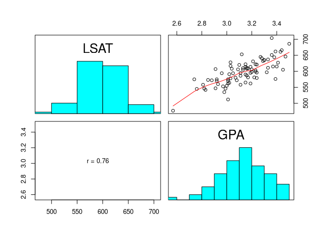
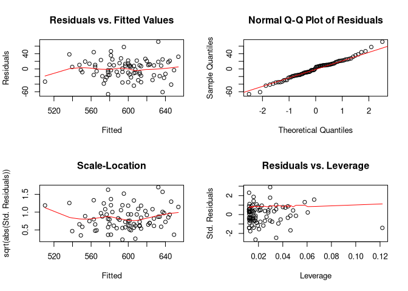

jeksterslabRlinreg
================
Ivan Jacob Agaloos Pesigan
2020-07-26

<!-- README.md is generated from README.Rmd. Please edit that file -->

<!-- badges: start -->

[](https://travis-ci.com/jeksterslabds/jeksterslabRlinreg)
[](https://ci.appveyor.com/project/jeksterslabds/jeksterslabRlinreg)
[](https://codecov.io/github/jeksterslabds/jeksterslabRlinreg)
<!-- badges: end -->

`jeksterslabRlinreg` is a collection of functions that I find useful in
studying linear regression concepts and methods.

## Installation

You can install the released version of `jeksterslabRlinreg` from
[GitHub](https://github.com/jeksterslabds/jeksterslabRlinreg) with:

``` r
library(devtools)
install_github("jeksterslabds/jeksterslabRlinreg")
```

## Example

### Data

In this example, we examine the association between `GPA` and `LSAT`
scores.

See `jeksterslabRdatarepo::law()` for more information about the data
set used.

    #>      Intercept  GPA
    #> [1,]         1 3.23
    #> [2,]         1 2.83
    #> [3,]         1 3.24
    #> [4,]         1 3.12
    #> [5,]         1 3.09
    #> [6,]         1 3.39
    #>      LSAT
    #> [1,]  622
    #> [2,]  542
    #> [3,]  579
    #> [4,]  653
    #> [5,]  606
    #> [6,]  576

### `jeksterslabRlinreg::linreg()`

The `jeksterslabRlinreg::linreg()` function fits a linear regression
model using `X` and `y`. In this example, `X` consists of a column of
constants and `GPA` and `y` consists of `LSAT` scores.

The output includes the following:

  - ANOVA table
  - Table of regression coefficients with the following columns
      - Regression coefficients
      - Standard errors
      - \(t\) statistic
      - \(p\) value
      - Standardized coefficients
  - Confidence intervals (0.05, 0.5, 2.5, 97.5, 99.5, 99.95)
  - Means and standard deviations
  - Scatterplot matrix
  - Residual plots

<!-- end list -->

``` r
jeksterslabRlinreg::linreg(
  X = X,
  y = y
)
#> 
#> ANOVA Table:
#>       df        SS         MS        F           p
#> Model  1  69304.85 69304.8538 109.3925 1.24029e-16
#> Error 80  50683.45   633.5431       NA          NA
#> Total 81 119988.30         NA       NA          NA
#> 
#> Coefficients:
#>               coef       se         t           p std. coef
#> Intercept 113.6474 46.34954  2.451964 1.63854e-02 0.0000000
#> GPA       154.3605 14.75851 10.459086 1.24029e-16 0.7599979
#> 
#> Confidence Intervals:
#>             ci_0.05     ci_0.5   ci_2.5  ci_97.5  ci_99.5 ci_99.95
#> Intercept -44.69825  -8.654677  21.4089 205.8860 235.9495 271.9931
#> GPA       103.94046 115.417366 124.9901 183.7309 193.3036 204.7805
#> 
#> Means and Standard Deviations:
#>            Mean         SD
#> LSAT 597.548780 38.4881423
#> GPA    3.134878  0.1894973
```



See [GitHub
Pages](https://jeksterslabds.github.io/jeksterslabRlinreg/index.html)
for package documentation.
