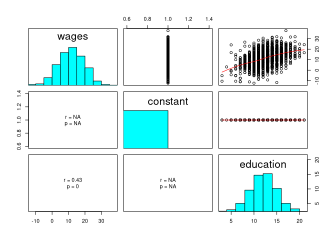
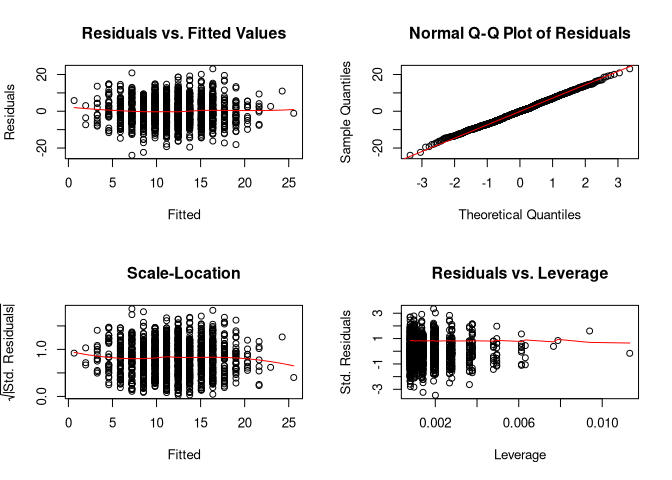

jeksterslabRlinreg
================
Ivan Jacob Agaloos Pesigan
2020-08-19

<!-- README.md is generated from README.Rmd. Please edit that file -->

<!-- badges: start -->

[](https://travis-ci.com/jeksterslabds/jeksterslabRlinreg)
[](https://ci.appveyor.com/project/jeksterslabds/jeksterslabRlinreg)
[](https://codecov.io/github/jeksterslabds/jeksterslabRlinreg)
<!-- badges: end -->

`jeksterslabRlinreg` is a collection of functions that I find useful in
studying linear regression concepts and methods.

## Installation

You can install the released version of `jeksterslabRlinreg` from
[GitHub](https://github.com/jeksterslabds/jeksterslabRlinreg) with:

``` r
library(devtools)
install_github("jeksterslabds/jeksterslabRlinreg")
```

## Example

### Data

In this hypothetical example, we are interested in the association
between wages and education. The regressor variable is years of
education. The regressand variable is hourly wage in US dollars.

    #>      constant education
    #> [1,]        1        13
    #> [2,]        1         8
    #> [3,]        1        14
    #> [4,]        1        13
    #> [5,]        1        10
    #> [6,]        1        12
    #>          wages
    #> [1,]  9.519885
    #> [2,]  4.925205
    #> [3,] 13.910238
    #> [4,] 10.867368
    #> [5,] 19.044241
    #> [6,] 11.709789

### `jeksterslabRlinreg::linreg()`

The `jeksterslabRlinreg::linreg()` function fits a linear regression
model using `X` and `y`. In this example, `X` consists of a column of
constants and years of `education` and `y` consists of hourly `wages` in
US dollars.

The output includes the following:

  - Model assessment
  - ANOVA table
  - Table of regression coefficients with the following columns
      - Regression coefficients
      - Standard errors
      - \(t\) statistic
      - \(p\) value
      - Standardized coefficients
  - Confidence intervals (0.05, 0.5, 2.5, 97.5, 99.5, 99.95)
  - Means and standard deviations
  - Scatterplot matrix
  - Residual plots

<!-- end list -->

``` r
jeksterslabRlinreg::linreg(
  X = X,
  y = y
)
#> 
#> Model Assessment:
#>                   Value
#> RSS            62662.52
#> MSE               48.61
#> RMSE               6.97
#> R-squared          0.21
#> Adj. R-squared     0.21
#> 
#> ANOVA Table:
#>         df       SS          MS        F            p
#> Model    1 16362.66 16362.66489 336.0661 7.082401e-67
#> Error 1287 62662.52    48.68882       NA           NA
#> Total 1288 79025.18          NA       NA           NA
#> 
#> Coefficients:
#>                coef        se         t            p
#> Intercept -4.669358 0.9137052 -5.110355 3.701033e-07
#> education  1.304368 0.0711521 18.332107 7.082401e-67
#> 
#> Standardized Coefficients:
#> Textbook standard errors are used.
#>                coef         se        t            p
#> education 0.4550344 0.02482172 18.33211 7.082401e-67
#> 
#> Confidence Intervals - Regression Coefficients:
#>             ci_0.05    ci_0.5    ci_2.5   ci_97.5   ci_99.5  ci_99.95
#> Intercept -7.682851 -7.026402 -6.461873 -2.876843 -2.312314 -1.655864
#> education  1.069701  1.120820  1.164781  1.443955  1.487916  1.539035
#> 
#> Confidence Intervals - Standardized Slopes:
#>             ci_0.05   ci_0.5   ci_2.5   ci_97.5   ci_99.5 ci_99.95
#> education 0.3731699 0.391003 0.406339 0.5037299 0.5190659 0.536899
#> 
#> Means and Standard Deviations:
#>               Mean       SD
#> wages     11.69747 7.832940
#> education 12.54771 2.732556
```



See [GitHub
Pages](https://jeksterslabds.github.io/jeksterslabRlinreg/index.html)
for package documentation.
